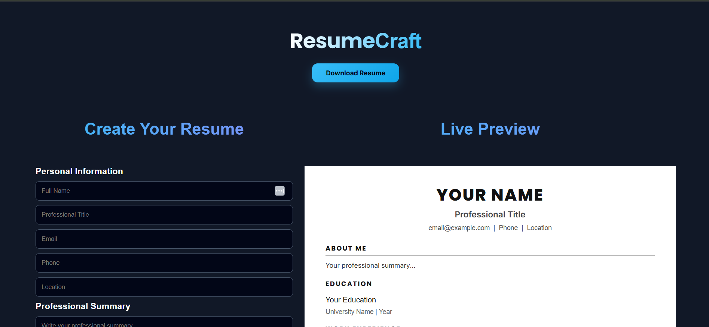

# ResumeCraft

A simple and modern resume builder that helps users create professional CVs with a live preview using HTML, CSS, and JavaScript.

## 🚀 Live Demo

https://devmaster1987.github.io/ResumeCraft/

## ✨ Features

- Live resume preview
- Custom personal information
- Experience, education, and skills sections
- Modern resume design
- Download/print resume
- Responsive layout

## 🛠️ Built With

- HTML
- CSS
- JavaScript

## 📌 Usage

Clone the repository and open `index.html` in your browser.

## 🤝 Contributing

Contributions are welcome! Feel free to open an issue or submit a pull request.

## 📄 License

MIT